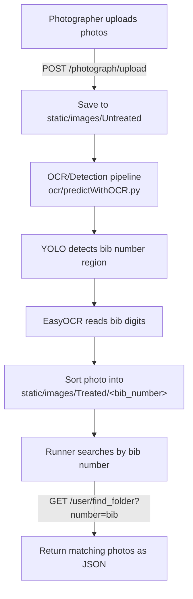

# Marathony

Marathony is a system for identifying and retrieving marathon participants' photos by detecting their **bib (race number)** in event photography. Photographers upload the raw photo dump, the system detects and reads each bib number with computer vision and OCR, sorts the photos into per-runner folders, and runners can then search by their bib number to instantly find every photo they appear in.

## How it works

1. **Upload** – Race photographers upload a batch of images through the `/photograph/upload` endpoint. Files are stored in `static/images/Untreated`.
2. **Detect & Read** – An OCR/detection pipeline (built on Ultralytics YOLO and EasyOCR) scans each image, locates bib numbers, and extracts the digits.
3. **Sort** – Photos are organized into folders named after the detected bib number under `static/images/Treated`.
4. **Search** – Runners query the `/user/find_folder` endpoint with their bib number to retrieve every photo of themselves from the event.

## System flow



## Tech stack

- **Backend:** Python, Flask, Flask-CORS
- **Computer vision / OCR:** Ultralytics (YOLO), EasyOCR, OpenCV, Torch/Torchvision
- **Data & utilities:** NumPy, Pandas, Matplotlib, Pillow

## Project structure

```
Marathony/
├── app.py                  # Flask app entry point, registers blueprints
├── user.py                 # User-facing routes (dashboard, search by bib number)
├── photograph.py           # Photographer-facing routes (dashboard, photo upload)
├── ocr/
│   └── predictWithOCR.py   # Bib detection + OCR prediction pipeline
├── model/                  # Detection model files
└── requirements.txt        # Python dependencies
```

## API endpoints

| Method | Endpoint                        | Description                                                   |
|--------|----------------------------------|----------------------------------------------------------------|
| GET    | `/user/user_dashboard`           | User dashboard placeholder                                     |
| GET    | `/user/find_folder?number=<bib>` | Returns all photos found for a given bib number                |
| POST   | `/photograph/photograph_dashboard` | Photographer dashboard placeholder                           |
| POST   | `/photograph/upload`             | Upload one or more photos; triggers bib detection/OCR pipeline |

## Getting started

### Prerequisites

- Python 3.8+
- pip

### Installation

```bash
git clone https://github.com/mmedj/Marathony.git
cd Marathony
pip install -r requirements.txt
```

### Running the app

```bash
python app.py
```

The Flask development server will start (debug mode enabled by default).

### Uploading photos

Send a `POST` request to `/photograph/upload` with one or more files under the `files` field (e.g. using `curl` or a form-data client). Uploaded images are saved to `static/images/Untreated`, and the OCR pipeline runs automatically to detect and sort bib numbers.

### Searching for your photos

Send a `GET` request to `/user/find_folder` with a `number` query parameter set to your bib number:

```
GET /user/find_folder?number=1234
```

This returns a JSON list of image paths matching that bib number from `static/images/Treated`.

## Notes

- This project is under active development; some endpoints (dashboards) are placeholders.
- Detection/OCR accuracy depends on the underlying YOLO model weights and EasyOCR configuration in `ocr/predictWithOCR.py`.

## License

No license has been specified for this repository. Please contact the repository owner for usage terms.
